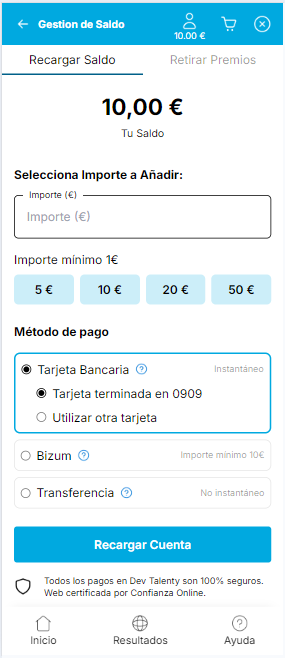
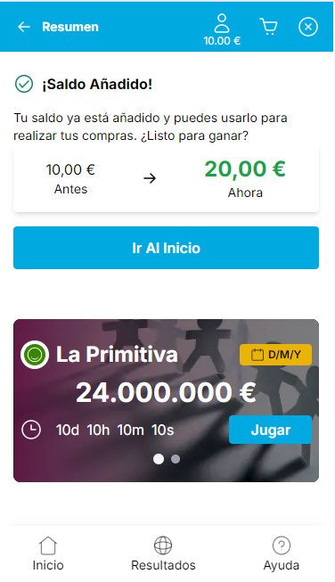

## Gestión de datos

Comandos para correr la aplicación en local:

```bash
npm run dev
# or
yarn dev
# or
pnpm dev
# or
bun dev
```

## Imagenes de la app
<div>
  
</div>
<div>
  
  
</div>
<div>
  
</div>
<div>
  
  
</div>

## Proyecto

El proyecto fue realizado con Next.js y los estilos con TailwindCSS.
La app tiene el Layout.tsx donde está configurada la fuente a usar en todo el proyecto, también se importa el Componente Footer para que sea visualizado en todas las páginas de la app.

Cuenta en el momento con 4 paginas: el home, premios, provider-screen(se muestra cuando se realiza la transaccion - la recarga) y resultados.

Tiene componentes reutilizables para implementarlos en las diferentes páginas.
Todas las imagenes las tomé del figma para que sean iguales al diseño.

En algunos componentes cree array de objetos para recorrerlo y no hacer mas código repetido del necesario.

En el global.css cree unas variables de colores para usar en toda la app, en Tailwind.config.ts se da estructura para poderlos usar solo con los nombres, así cuando se requiera cambiar un color solo se cambia en el global.css y se reflejará en toda la app.

La app no está 100% funcional ya que está mas enfocada al uso de TailwindCSS y que quedara lo más parecida posible al diseño solicitado.


